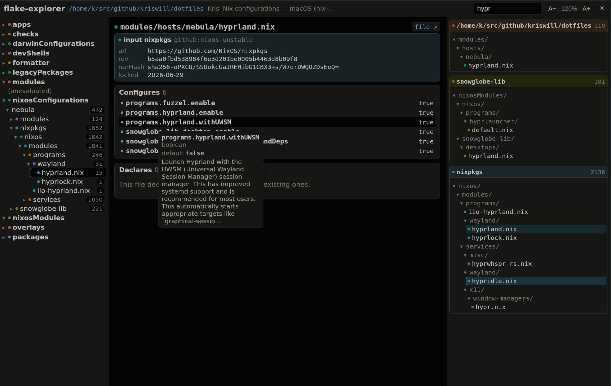

# flake-explorer

Interactive visualizer for Nix flakes — built for dendritic
([flake-parts](https://flake.parts) + [import-tree](https://github.com/vic/import-tree))
configurations, works on any flake.



Three panes:

- **Left — outputs & modules.** Every flake output (`nixosConfigurations`,
  `darwinConfigurations`, `packages`, `overlays`, …). Expanding a
  configuration reveals its module hierarchy: your own module files in their
  directory (mounting) structure, plus per-input subtrees for modules that
  come from flake inputs. Badges count customized options per subtree.
- **Center — detail.** Selecting a module shows **Configures** (option values
  this file sets — with `mkForce`/`mkDefault` priority chips and
  customized-vs-defaulted styling) and **Declares** (options this file
  defines — type, default, current value). Hovering an option shows its type,
  default, priority, and description. Modules from inputs show full
  provenance from `flake.lock` (url, rev, narHash, lastModified).
- **Right — files.** Every `.nix` file the flake references, grouped by
  origin (self first, then inputs). Hovering a file highlights the modules it
  customizes on the left; selecting it shows its last git commit and which
  files import it / it imports.

Selections are deep-linkable (URL hash); light/dark theme; colors are stable
per file/input (curated CVD-safe slots + OKLCH hash colors).

## Usage

```console
$ nix run github:kriswill/flake-explorer -- serve /etc/nixos
flake-explorer serving /etc/nixos at http://localhost:4321
```

`serve` extracts the cheap manifest up front and evaluates each
configuration's options **on demand** the first time you open it (cached by
flake narHash; a full NixOS system takes a minute or two the first time).

Pre-extract instead with:

```console
$ flake-explorer extract /etc/nixos --all           # every configuration
$ flake-explorer extract . --configs nixos/myhost   # just one
```

Flags: `--out DIR` (data dir, default `./flake-explorer-data`), `--port N`,
`--all-systems`, `--timeout SECS`.

## How it works

- One `extract.nix` evaluated via `nix eval --impure --json` (uses YOUR nix,
  never a vendored one, so store paths and registry match your system).
- Options are walked **chunk-by-chunk** (per top-level namespace, splitting
  failing chunks recursively) because `builtins.tryEval` cannot catch
  missing-attribute/type errors — one poisoned option costs itself, not the
  whole configuration. Values degrade gracefully (full → no values → no
  values+descriptions) and every degradation is surfaced as a warning.
- Customized-vs-default is decided by definition priority
  (`highestPrio < 1500`), not `isDefined` — every option with a default is
  "defined" by its own declaration.
- Files are attributed to inputs by store-path prefix (including transitive
  inputs and patched trees à la `nixpkgs.applyPatches`); your own files get
  per-file `git log` info.

## Development

```console
$ nix develop          # bun + git
$ bun install
$ bun flake-explorer.ts serve /etc/nixos
$ bun test             # unit tests (happy-dom)
$ bunx svelte-check --tsconfig ./tsconfig.json
$ nix build            # package + offline test derivation
```

Svelte 5 (runes) bundled by `Bun.build` + `bun-plugin-svelte` — no Vite.
Data contract between the extractor and the SPA lives in `src/schema.ts`.

## License

MIT
