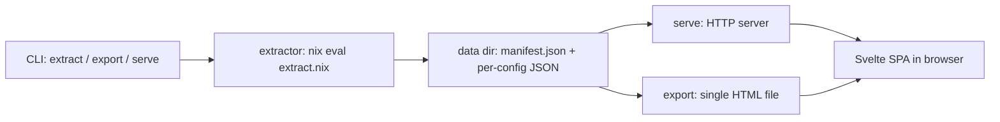

# flake-explorer documentation

flake-explorer is an interactive visualizer for Nix flakes — optimized for dendritic
([flake-parts](https://flake.parts) + [import-tree](https://github.com/vic/import-tree))
configurations, but it works on any flake. It evaluates a flake with your own
`nix` binary, extracts its outputs, module hierarchy, option values, and file
provenance into JSON, and renders them in a three-pane Svelte 5 SPA that can be
served locally or exported as a single standalone HTML file
(see the top-level [README](../README.md) for quick-start usage).

The three panes:

- **Left — outputs & modules.** Every flake output; expanding a configuration
  reveals its module hierarchy in the flake's own directory (mounting)
  structure, plus per-input subtrees, with badges counting customized options.
- **Center — detail.** A selected module's **Configures** (values it sets, with
  `mkForce`/`mkDefault` priority chips) and **Declares** (options it defines),
  plus full `flake.lock` provenance for input modules.
- **Right — files.** Every `.nix` file the flake references, grouped by origin
  (self first, then inputs), with per-file git info and import relationships.

## System at a glance

One CLI entry point ([`flake-explorer.ts`](../flake-explorer.ts)) dispatches
`extract`, `export`, and `serve`. All three run the same extraction driver,
which shells out to the host `nix` binary to evaluate
[`src/extract/extract.nix`](../src/extract/extract.nix) and writes a data
directory: a cheap `manifest.json` plus one expensive per-configuration blob.
`serve` builds the SPA in-memory and extracts configurations on demand;
`export` embeds the SPA and data into one HTML file
([`src/export.ts`](../src/export.ts)).

## Pages

| Page | What it answers |
| --- | --- |
| [Architecture](architecture.md) | How the pieces fit together; key design decisions and the directory map. |
| [Data schema](data-schema.md) | The manifest / config-blob contract in [`src/schema.ts`](../src/schema.ts). |
| [Extraction pipeline](extraction-pipeline.md) | How `extract.nix`, the chunk walk, and the narHash cache work. |
| [Frontend](frontend.md) | The Svelte 5 SPA: state, indexes, components, theming. |
| [Build & infra](build-and-infra.md) | Bun bundling, Nix packaging, CI, and Pages publishing. |
| [CLI reference](cli.md) | Every command and flag of the `flake-explorer` CLI. |
| [Testing](testing.md) | The bun test suite, fixtures, and how to run it. |
| [Glossary](glossary.md) | Project-specific terms, each linked to its source. |

## Links

- Live demo: <https://kris.net/flake-explorer/> — the tool exploring its own flake.
- API reference: <https://kris.net/flake-explorer/docs/api/> — generated in CI
  from [`src/schema.ts`](../src/schema.ts) via typedoc; only on the site.
- Repository: <https://github.com/kriswill/flake-explorer>
- [CHANGELOG](../CHANGELOG.md)
