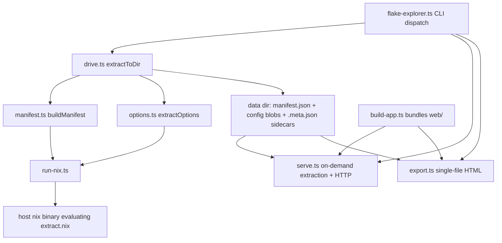

# Architecture

flake-explorer is three cooperating layers: a TypeScript CLI/extraction layer
that drives the host `nix` binary, a JSON data directory that both persists and
caches extraction results, and a Svelte 5 SPA that consumes those documents
either over HTTP or embedded in a single exported HTML file. The contract
between the layers is one file: [`src/schema.ts`](../src/schema.ts).

## System overview

The CLI ([`flake-explorer.ts`](../flake-explorer.ts)) parses flags,
canonicalizes the flakeref, and dispatches to `extract`, `export`, or `serve`.
`extract` and `export` share [`src/extract/drive.ts`](../src/extract/drive.ts)
(`extractToDir`), which builds the manifest, reconciles the on-disk cache, and
extracts requested configurations. All Nix evaluation goes through
[`src/extract/run-nix.ts`](../src/extract/run-nix.ts), a thin JSON-in/JSON-out
wrapper that runs `nix eval --impure --json` on
[`src/extract/extract.nix`](../src/extract/extract.nix).

```mermaid
flowchart TD
  cli["flake-explorer.ts CLI dispatch"] --> drive["drive.ts extractToDir"]
  drive --> manifest["manifest.ts buildManifest"]
  drive --> options["options.ts extractOptions"]
  manifest --> runnix["run-nix.ts"]
  options --> runnix
  runnix --> nix["host nix binary evaluating extract.nix"]
  drive --> data["data dir: manifest.json + config blobs + .meta.json sidecars"]
  cli --> serve["serve.ts on-demand extraction + HTTP"]
  cli --> export["export.ts single-file HTML"]
  data --> serve
  data --> export
  app["build-app.ts bundles web/"] --> serve
  app --> export
```

The data dir (default `./flake-explorer-data`) holds `manifest.json`, one
`config/<kind>.<name>.json` blob per extracted configuration, and a
`.meta.json` sidecar per blob recording the flake narHash and extractor
version that produced it ([`src/extract/cache.ts`](../src/extract/cache.ts)).
Two consumers read it: [`src/serve.ts`](../src/serve.ts) serves the SPA plus
data over HTTP, extracting pending configurations on demand (single-flight per
config, request held open); [`src/export.ts`](../src/export.ts) composes the
SPA and every data document into one standalone HTML file that works from
`file://` with no server. Both get the SPA from
[`src/build-app.ts`](../src/build-app.ts), which bundles
[`web/main.ts`](../web/main.ts) in-memory.

## Design decisions

- **Host nix, never vendored.** The `nix` on PATH is deliberately the user's
  own — [`package.nix`](../package.nix) never vendors one and
  [`flake.nix`](../flake.nix) deliberately keeps nix out of the dev shell — so
  store paths and the flake registry match the user's system.
  [`src/extract/run-nix.ts`](../src/extract/run-nix.ts) checks version >= 2.19
  at startup and forces `lazy-trees = false` so store paths join across evals.
- **Chunk-by-chunk option walk.** `builtins.tryEval` cannot catch
  missing-attribute/type errors, so one poisoned option would kill an entire
  eval. [`src/extract/options.ts`](../src/extract/options.ts) walks options per
  top-level namespace, recursively halving failing chunks to isolate the bad
  option; only an unsplittable chunk descends the degradation ladder
  (full → no values → no values+descriptions) before being abandoned.
- **Bun.build, not Vite.** [`src/build-app.ts`](../src/build-app.ts) bundles
  the Svelte 5 (runes) SPA with `Bun.build` + `bun-plugin-svelte`, returning
  JS and CSS as strings that [`src/serve.ts`](../src/serve.ts) and
  [`src/export.ts`](../src/export.ts) compose into a page — no separate build
  tool or dev server.
- **One shared data contract.** [`src/schema.ts`](../src/schema.ts) defines
  both documents (cheap `Manifest`, expensive per-config `ConfigData`) for the
  extractor and the SPA alike, with `storePath` as the universal join key
  between file entries and option declarations/definitions. See
  [Data schema](data-schema.md).

## Directory map

| Path | Contents |
| --- | --- |
| [`src/`](../src) | The Rust crate — CLI entry ([`main.rs`](../src/main.rs)), server ([`serve.rs`](../src/serve.rs)), static export ([`export.rs`](../src/export.rs)), page composition ([`page.rs`](../src/page.rs)), the data contract ([`schema.rs`](../src/schema.rs)), and the extractor ([`drive.rs`](../src/drive.rs), [`manifest.rs`](../src/manifest.rs), [`options.rs`](../src/options.rs), [`cache.rs`](../src/cache.rs), [`run_nix.rs`](../src/run_nix.rs), [`extract.nix`](../src/extract.nix)). |
| [`src/vendor/`](../src/vendor) | Vendored tree-sitter highlight queries (`nix-highlights.scm`, `bash-highlights.scm`) for server-side tokenizing. |
| [`web/`](../web) | The SPA: [`App.svelte`](../web/App.svelte), `components/`, and `lib/` (state, indexes, colors, URL routing), each with its `*.test.ts` alongside. See [Frontend](frontend.md). |
| [`web/testing/`](../web/testing) | Bun-test support: preloads, the `withMount` helper, and the shared fixture builders. |
| [`tests/`](../tests) | Rust integration suites (CLI, serve, export, degradation, real-nix). See [Testing](testing.md). |
| [`fixtures/`](../fixtures) | Nix fixture flakes the Rust suites evaluate (`mini-flake`, `broken-flake`). |
| [`bin/`](../bin) | [`flake-explorer.mjs`](../bin/flake-explorer.mjs) — npm launcher that resolves the platform binary package and execs it with this package's SPA bundle. |
| [`scripts/`](../scripts) | Bun tooling: SPA bundling ([`bundle-app.ts`](../scripts/bundle-app.ts), [`build-app.ts`](../scripts/build-app.ts)), docs site ([`build-docs.ts`](../scripts/build-docs.ts)), npm staging ([`build-npm.ts`](../scripts/build-npm.ts)), release ([`release.ts`](../scripts/release.ts)). |
| `dist/` | All build output, git-ignored: `app/` (SPA bundle), `npm/` (staged packages), `site/` (Pages), `api/` (typedoc), `coverage/`. |
| [`.github/workflows/`](../.github/workflows) | CI ([`ci.yml`](../.github/workflows/ci.yml)) and Pages publishing ([`pages.yml`](../.github/workflows/pages.yml)). See [Build & infra](build-and-infra.md). |
