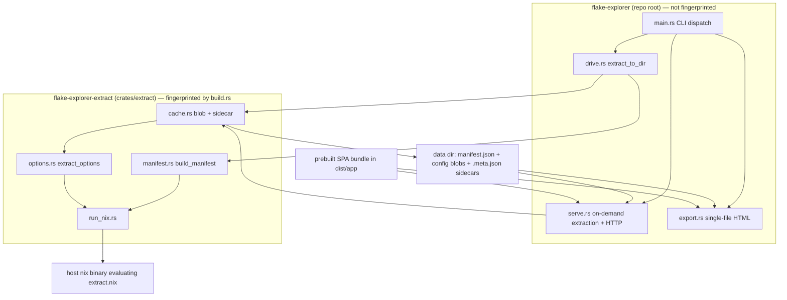

# Architecture

flake-explorer is three cooperating layers: a native Rust CLI/extraction layer
that drives the host `nix` binary, a JSON data directory that both persists and
caches extraction results, and a Svelte 5 SPA that consumes those documents
either over HTTP or embedded in a single exported HTML file. The contract
between the layers is one file, mirrored on each side:
[`crates/extract/src/schema.rs`](../crates/extract/src/schema.rs) and [`web/lib/schema.ts`](../web/lib/schema.ts).

## Two crates

The Rust side is a cargo workspace with two members, and the line between them
is the one the extraction cache is keyed on:

- **`flake-explorer-extract`** ([`crates/extract/`](../crates/extract)) — every
  module whose output can end up inside a cached blob or the persisted
  manifest. Its `build.rs` content-hashes this crate, and that hash is the code
  half of the cache key.
- **`flake-explorer`** (the repo root) — the CLI, the extraction driver, the
  HTTP server, the static exporter, page composition. Reads blobs, renders
  them, cannot shape them.

So editing the server or the exporter leaves every user's cached extractions
intact, while editing anything the extractor can serialise invalidates them
automatically. [Extraction pipeline](extraction-pipeline.md#the-extraction-crate-boundary)
covers why the boundary is a crate rather than a list of hashed files, the two
non-obvious placements (`highlight` in, `reverse_deps` out), and the one thing
the boundary does not cover.

The root crate stays at the repo root rather than moving under `crates/`
because `page.rs` and `serve.rs` locate `dist/app`, `scripts/bundle-app.ts` and
`web/` through `env!("CARGO_MANIFEST_DIR")`, and the devShell's live shim runs
`cargo run --manifest-path $root/Cargo.toml`.

## System overview

The CLI ([`src/main.rs`](../src/main.rs)) parses flags,
canonicalizes the flakeref, and dispatches to `extract`, `export`, or `serve`.
`extract` and `export` share [`src/drive.rs`](../src/drive.rs)
(`extract_to_dir`), which builds the manifest, reconciles the on-disk cache, and
extracts requested configurations. All Nix evaluation goes through
[`crates/extract/src/run_nix.rs`](../crates/extract/src/run_nix.rs), a thin JSON-in/JSON-out
wrapper that runs `nix eval --impure --json` on
[`crates/extract/src/extract.nix`](../crates/extract/src/extract.nix).

The SPA is not built by the binary. `bun scripts/bundle-app.ts` compiles it
ahead of time into `dist/app/`, and the binary locates that bundle at runtime
([`src/page.rs`](../src/page.rs)) to compose the page.

Arrows cross the crate boundary in one direction only — that is what makes the
fingerprint's scope trustworthy:

```mermaid
flowchart TD
  subgraph root["flake-explorer (repo root) — not fingerprinted"]
    cli["main.rs CLI dispatch"]
    drive["drive.rs extract_to_dir"]
    serve["serve.rs on-demand extraction + HTTP"]
    export["export.rs single-file HTML"]
  end
  subgraph ext["flake-explorer-extract (crates/extract) — fingerprinted by build.rs"]
    manifest["manifest.rs build_manifest"]
    options["options.rs extract_options"]
    cache["cache.rs blob + sidecar"]
    runnix["run_nix.rs"]
  end
  cli --> drive
  cli --> serve
  cli --> export
  drive --> manifest
  drive --> cache
  cache --> options
  manifest --> runnix
  options --> runnix
  runnix --> nix["host nix binary evaluating extract.nix"]
  cache --> data["data dir: manifest.json + config blobs + .meta.json sidecars"]
  data --> serve
  data --> export
  serve --> cache
  app["prebuilt SPA bundle in dist/app"] --> serve
  app --> export
```

The data dir (default `./flake-explorer-data`) holds `manifest.json`, one
`config/<kind>.<name>.json` blob per extracted configuration, and a
`.meta.json` sidecar per blob recording the flake narHash and extractor
version that produced it ([`crates/extract/src/cache.rs`](../crates/extract/src/cache.rs)).
Two consumers read it: [`src/serve.rs`](../src/serve.rs) serves the SPA plus
data over HTTP, extracting pending configurations on demand (single-flight per
config, request held open); [`src/export.rs`](../src/export.rs) composes the
SPA and every data document into one standalone HTML file that works from
`file://` with no server. Both load the same prebuilt bundle through
[`src/page.rs`](../src/page.rs).

## Design decisions

- **Host nix, never vendored.** The `nix` on PATH is deliberately the user's
  own — [`package.nix`](../package.nix) never vendors one and
  [`flake.nix`](../flake.nix) deliberately keeps nix out of the dev shell — so
  store paths and the flake registry match the user's system.
  [`crates/extract/src/run_nix.rs`](../crates/extract/src/run_nix.rs) checks version >= 2.19
  at startup and forces `lazy-trees = false` so store paths join across evals.
- **Chunk-by-chunk option walk.** `builtins.tryEval` cannot catch
  missing-attribute/type errors, so one poisoned option would kill an entire
  eval. [`crates/extract/src/options.rs`](../crates/extract/src/options.rs) walks options per
  top-level namespace, recursively halving failing chunks to isolate the bad
  option; only an unsplittable chunk descends the degradation ladder
  (full → no values → no values+descriptions) before being abandoned.
- **Bun.build, not Vite.** [`scripts/build-app.ts`](../scripts/build-app.ts) bundles
  the Svelte 5 (runes) SPA with `Bun.build` + `bun-plugin-svelte` — no separate
  build tool or dev server. [`scripts/bundle-app.ts`](../scripts/bundle-app.ts)
  writes the result to `dist/app/` as `app.js`, `app.css`, and a `meta.json`
  carrying the generated theme CSS and About data, which is the whole interface
  between the bun side and the Rust binary.
- **One shared data contract.** [`crates/extract/src/schema.rs`](../crates/extract/src/schema.rs) defines
  both documents (cheap `Manifest`, expensive per-config `ConfigData`) for the
  extractor and the SPA alike, with `storePath` as the universal join key
  between file entries and option declarations/definitions. See
  [Data schema](data-schema.md).

## Directory map

| Path | Contents |
| --- | --- |
| [`src/`](../src) | The root crate, `flake-explorer` — CLI entry ([`main.rs`](../src/main.rs)), extraction driver ([`drive.rs`](../src/drive.rs)), server ([`serve.rs`](../src/serve.rs)), static export ([`export.rs`](../src/export.rs)), page composition ([`page.rs`](../src/page.rs)), reverse-dependency index ([`reverse_deps.rs`](../src/reverse_deps.rs)). Nothing here can shape a cached blob. |
| [`crates/extract/`](../crates/extract) | The `flake-explorer-extract` crate — the data contract ([`schema.rs`](../crates/extract/src/schema.rs)) and everything whose output is persisted: [`manifest.rs`](../crates/extract/src/manifest.rs), [`options.rs`](../crates/extract/src/options.rs), [`package.rs`](../crates/extract/src/package.rs), [`cache.rs`](../crates/extract/src/cache.rs), [`run_nix.rs`](../crates/extract/src/run_nix.rs), [`git.rs`](../crates/extract/src/git.rs), [`scan.rs`](../crates/extract/src/scan.rs), [`pathref.rs`](../crates/extract/src/pathref.rs), [`highlight.rs`](../crates/extract/src/highlight.rs), [`extract.nix`](../crates/extract/src/extract.nix). [`build.rs`](../crates/extract/build.rs) fingerprints it into the cache key. |
| [`crates/extract/src/vendor/`](../crates/extract/src/vendor) | Vendored tree-sitter highlight queries (`nix-highlights.scm`, `bash-highlights.scm`) for server-side tokenizing. Hashed with the crate, since tokenized phase scripts land in package blobs. |
| [`web/`](../web) | The SPA: [`App.svelte`](../web/App.svelte), `components/`, and `lib/` (state, indexes, colors, URL routing), each with its `*.test.ts` alongside. See [Frontend](frontend.md). |
| [`web/testing/`](../web/testing) | Bun-test support: preloads, the `withMount` helper, and the shared fixture builders. |
| [`tests/`](../tests) | Rust integration suites (CLI, serve, export, degradation, real-nix). See [Testing](testing.md). |
| [`fixtures/`](../fixtures) | Nix fixture flakes the Rust suites evaluate (`mini-flake`, `broken-flake`). |
| [`bin/`](../bin) | [`flake-explorer.mjs`](../bin/flake-explorer.mjs) — npm launcher that resolves the platform binary package and execs it with this package's SPA bundle. |
| [`scripts/`](../scripts) | Bun tooling: SPA bundling ([`bundle-app.ts`](../scripts/bundle-app.ts), [`build-app.ts`](../scripts/build-app.ts)), docs site ([`build-docs.ts`](../scripts/build-docs.ts)), npm staging ([`build-npm.ts`](../scripts/build-npm.ts)), release ([`release.ts`](../scripts/release.ts)). |
| `dist/` | All build output, git-ignored: `app/` (SPA bundle), `npm/` (staged packages), `site/` (Pages), `api/` (typedoc), `coverage/`. |
| [`.github/workflows/`](../.github/workflows) | CI ([`ci.yml`](../.github/workflows/ci.yml)) and Pages publishing ([`pages.yml`](../.github/workflows/pages.yml)). See [Build & infra](build-and-infra.md). |
