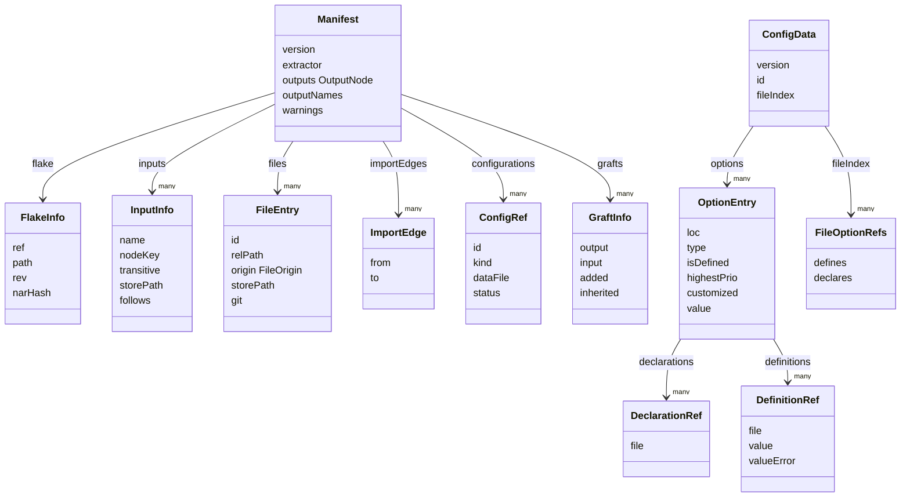

# Data schema

The JSON contract between the extraction CLI and the SPA lives in a single file, [`src/schema.ts`](../src/schema.ts). There are exactly two document kinds:

| Document | File | Cost | Lifecycle |
| --- | --- | --- | --- |
| `Manifest` | `manifest.json` | Cheap | Always regenerated on every run (see [Extraction pipeline](extraction-pipeline.md)) |
| `ConfigData` | `config/<kind>.<name>.json` | Expensive (full options eval) | Extracted on demand, cached by extractor fingerprint + flake identity + lock hash |

`storePath` is the universal join key: `FileEntry.storePath` matches the file strings in each option's declarations and definitions.

## Versioning

| Constant | Value | Gates |
| --- | --- | --- |
| `SCHEMA_VERSION` | `1` | Stamped into both documents; the SPA rejects a `ConfigData` blob whose `version` mismatches (per its JSDoc in [`src/schema.ts`](../src/schema.ts)) |

There is no manually-bumped extractor version: the cache key's code half is a content hash of the extraction sources ([`src/extract/fingerprint.ts`](../src/extract/fingerprint.ts)), so any change under `src/extract/` or to `src/schema.ts` makes every cached blob stale at once. `reconcile` in [`src/extract/cache.ts`](../src/extract/cache.ts) additionally requires the sidecar's flake identity (`narHash`, or the self store path when absent) and resolved-input `lockHash` to match — see [Extraction pipeline](extraction-pipeline.md).

## Type overview

`OutputNode` is a recursive union (`attrset` | `leaf` | `omitted` | `unknown`) normalized from `nix flake show --json`; `FileOrigin` is `self` | `input` (optionally `patched`) | `unknown`.

## Join keys and the file id codec

- **storePath join**: `DeclarationRef.file` / `DefinitionRef.file` are absolute `/nix/store/...` paths (or the sentinel below). They join against `FileEntry.storePath` to attribute options to files.
- **File id codec**: `makeFileId` / `parseFileId` produce and parse `"self:<rel>"` | `"input:<name>:<rel>"`. Per their JSDoc this format is a *client-server protocol*, not just a display convention — serve's `/data/file/<id>` route re-derives input files from the id (re-fetching through Nix when the store path has been GC'd; see [CLI reference](cli.md)). Every construction and parse site must go through these helpers. App-internal `"unknown:…"`/`"inline"` buckets are opaque; `parseFileId` returns `null` for them.
- **fileIndex**: `ConfigData.fileIndex` maps storePath → indices into `options`, split into `defines` / `declares` (`FileOptionRefs`), precomputed so the SPA never scans thousands of options per click.

## Definition priorities

`PRIO` records the well-known `lib.mkOverride` values (lower wins):

| Name | Value | Meaning |
| --- | --- | --- |
| `mkForce` | 50 | `lib.mkForce` |
| `plain` | 100 | An ordinary definition |
| `mkDefault` | 1000 | `lib.mkDefault` |
| `optionDefault` | 1500 | The option's own declared default (`lib.mkOptionDefault`) |

An option is **customized** when `isDefined && highestPrio !== null && highestPrio < PRIO.optionDefault` (see `toEntry` in [`src/extract/options.ts`](../src/extract/options.ts)) — a real definition beat the declared default. `fileIndex.defines` only counts customized definitions, because every defaulted option carries a `mkOptionDefault` definition pointing at its declaring module, which would otherwise make nixpkgs "define" everything.

## Sentinels and grafts

- `UNKNOWN_FILE = "<unknown-file>"` — the file string the module system uses for inline/anonymous modules; it appears as a `fileIndex` key and in declaration/definition refs.
- `GraftInfo` marks a top-level output that extends an input's same-named namespace (e.g. `lib = nixpkgs.lib.extend …`). The heuristic lives in [`src/extract/extract.nix`](../src/extract/extract.nix): at least 90% of the input's attr names must reappear in the output (and the input must have at least 5 names; outputs consisting only of per-system names never count). The manifest records only the `added` keys plus an `inherited` count so the UI can hide the inherited bulk.

## Reference

The full generated API reference is at https://kris.net/flake-explorer/docs/api/ (CI-generated, site only). The source of truth is [`src/schema.ts`](../src/schema.ts).
