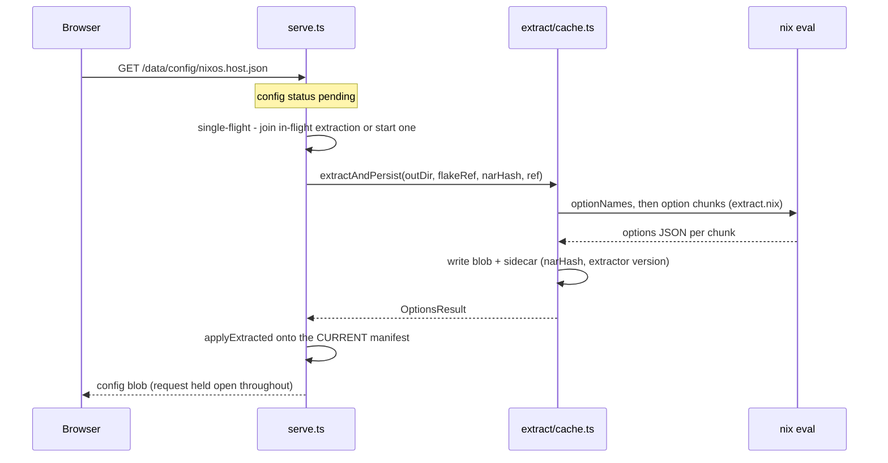

# Extraction pipeline

Extraction is two-phase. A **cheap manifest pass** (flake metadata, output tree, file list, import graph, git info) always runs up front and is always regenerated. The **expensive per-configuration options pass** — a full module-system eval — runs separately: eagerly for `extract`/`export`, or on demand in `serve` when the UI first opens a configuration. The two phases produce the two documents described in [Data schema](data-schema.md); the commands that drive them are in the [CLI reference](cli.md).

## Serve-mode on-demand flow

[`src/serve.ts`](../src/serve.ts) holds the config request open until extraction finishes (`idleTimeout: 0`). Concurrent requests for the same configuration are deduped by a single-flight map (`inflight: Map<configId, Promise>`): the first request starts the extraction, later ones await the same promise.

The cache check happens at manifest time, not per request: after every manifest build (startup and `POST /api/refresh`), `reconcile` flips configs to `ok` when their sidecar records the same flake `narHash` and `EXTRACTOR_VERSION` — those are served straight from disk. The narHash is captured at extraction *start*, because `/api/refresh` can swap the manifest mid-extraction and stamping the new hash onto data evaluated from the old flake state would poison the cache.

## Modules

### drive.ts — shared extraction driver

[`src/extract/drive.ts`](../src/extract/drive.ts) runs manifest + selected configurations into the data dir, reusing the narHash-keyed cache, and writes `manifest.json` so the data dir stays reconcilable for later runs. Both `extract` and `export` call it; it lives outside the CLI entry so tests can call it in-process.

### manifest.ts — the cheap pass

[`src/extract/manifest.ts`](../src/extract/manifest.ts) assembles the `Manifest`: `nix flake metadata` (lock graph, narHash), `nix flake show --json` (normalized across the classic and Determinate "inventory" formats), the `extract.nix` manifest eval (store paths, configuration names, `.nix` file list, grafts, output names), the static import graph, and per-file git info when the flakeref is a local checkout. Config names are sanitized (`safeName`) so a quoted attr name containing `/` cannot escape the data dir.

### extract.nix — the Nix-side core

[`src/extract/extract.nix`](../src/extract/extract.nix) is a single builtins-only expression (no nixpkgs `lib`, so it works on flakes without a nixpkgs input) invoked as `nix eval --impure --json --expr 'import <path>/extract.nix (builtins.fromJSON '…args…')'` — `--impure` is required for `builtins.getFlake` on path/dirty refs. It has a cheap `manifest` mode and an expensive `options` mode (plus `optionNames` for listing children). Value serialization is defensive: `scrub`/`deepSafe` degrade a poisoned value to a marker instead of killing the whole eval.

### options.ts — the chunk walk

[`src/extract/options.ts`](../src/extract/options.ts) walks the options tree in chunks (one per top-level namespace initially) because an uncatchable eval error — missing attr or type error, which `builtins.tryEval` cannot catch — poisons the entire eval it occurs in. The algorithm is **split first, degrade last**: a failing chunk is halved by children (or descended into) at the *same* detail level to isolate the poisoned option, so healthy siblings keep full values. Only an unsplittable leaf, or one at the depth cap (`MAX_DEPTH = 4`), walks down the degradation ladder — full → values skipped → values+descriptions skipped — before being abandoned with a warning. Chunks run on a small worker pool (2–8, derived from CPU count) and the queue is drained until no worker can push further splits.

### run-nix.ts — subprocess protocol

[`src/extract/run-nix.ts`](../src/extract/run-nix.ts) wraps the host's own `nix` binary (never vendored, so store paths and registry match the user's system; minimum version `MIN_NIX = 2.19`, checked by `checkNix`). All calls are JSON-in/JSON-out with a timeout that kills the process and a `NixError` carrying the underlying stderr and exit code. Args reach `extract.nix` via double `JSON.stringify` — a JSON string literal is a valid Nix string literal, so no hand-rolled Nix escaping. Every call passes `--option lazy-trees false` to keep store paths joinable across evals. `readInputFile` re-fetches an input file through `builtins.getFlake` when a cached store path has been GC'd or was a lazy-trees synthetic path.

### cache.ts — sidecar cache

[`src/extract/cache.ts`](../src/extract/cache.ts) keys the cache on flake `narHash` + `EXTRACTOR_VERSION`, recorded in a sidecar next to each blob (`config/<kind>.<name>.meta.json`). `extractAndPersist` writes blob + sidecar (with a path-traversal guard on `dataFile`); `reconcile` flips matching configs to `ok` on a fresh manifest. It deliberately does not mutate the `ConfigRef` itself — the caller applies the outcome to whichever manifest is current when extraction settles.

### git.ts — per-file commit info

[`src/extract/git.ts`](../src/extract/git.ts) gets each file's last commit from a **single streamed `git log --format=… --name-only -- '*.nix'` walk**: newest-first, the first time a path appears is its last commit — one O(history) subprocess instead of O(files) `git log -1` calls. `repoPrefix` bridges repo-root-relative git paths and flake-root-relative file paths when the flake lives in a subdirectory.

### imports.ts — static import graph

[`src/extract/imports.ts`](../src/extract/imports.ts) builds the file→file import graph with a regex scan (patterns in [`src/pathref.ts`](../src/pathref.ts)), not a parser: dendritic flakes have near-zero manual imports, false positives are harmless in a visualization, and `nix-instantiate --parse` re-prints Nix rather than emitting JSON, so a "real" approach would still be text-munging. Its header names tree-sitter-nix as the upgrade path.

### highlight.ts — server-side syntax highlighting

[`src/extract/highlight.ts`](../src/extract/highlight.ts) tokenizes Nix source with tree-sitter-nix compiled to WASM, vendored in `src/extract/vendor/` from nixpkgs' `pkgsCross.wasi32.tree-sitter-grammars.tree-sitter-nix` (a native WASI build — no emscripten or npm grammar package). It resolves the highlight query's captures into flat, non-overlapping runs (narrower node wins; on the same node the earlier-declared query pattern wins); the client only maps capture names to colors. The header documents the exact `nix build` + `cp` commands to regenerate the vendored grammar and query file.
