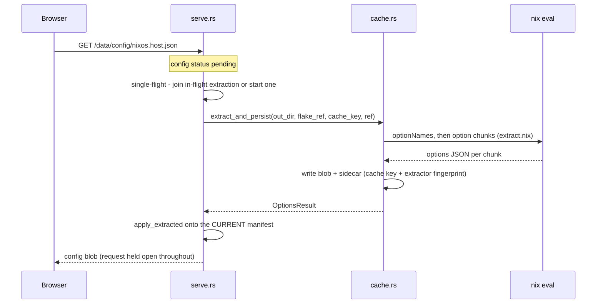

# Extraction pipeline

Extraction is two-phase. A **cheap manifest pass** (flake metadata, output tree, file list, import graph, git info) always runs up front and is always regenerated. The **expensive per-configuration options pass** — a full module-system eval — runs separately: eagerly for `extract`/`export`, or on demand in `serve` when the UI first opens a configuration. The two phases produce the two documents described in [Data schema](data-schema.md); the commands that drive them are in the [CLI reference](cli.md).

## Serve-mode on-demand flow

[`src/serve.rs`](../src/serve.rs) holds the config request open until extraction finishes — no fixed timeout, since an extraction can exceed any bound worth guessing. Concurrent requests for the same configuration are deduped through a single-flight map (`inflight: Mutex<HashMap<String, watch::Receiver<bool>>>`): the first request inserts a `watch` channel and starts the extraction, later ones clone the receiver and await the same completion signal.

```mermaid
sequenceDiagram
  participant B as Browser
  participant S as serve.rs
  participant C as cache.rs
  participant N as nix eval

  B->>S: GET /data/config/nixos.host.json
  Note over S: config status pending
  S->>S: single-flight - join in-flight extraction or start one
  S->>C: extract_and_persist(out_dir, flake_ref, cache_key, ref)
  C->>N: optionNames, then option chunks (extract.nix)
  N-->>C: options JSON per chunk
  C->>C: write blob + sidecar (cache key + extractor fingerprint)
  C-->>S: OptionsResult
  S->>S: apply_extracted onto the CURRENT manifest
  S-->>B: config blob (request held open throughout)
```

The cache check happens at manifest time, not per request: after every manifest build (startup and `POST /api/refresh`), `reconcile` flips configs to `ok` when their sidecar records the current cache key — an extractor-code fingerprint plus the flake's identity and resolved-input lock hash (see cache.rs below) — those are served straight from disk. The key is captured at extraction *start*, because `/api/refresh` can swap the manifest mid-extraction and stamping the new key onto data evaluated from the old flake state would poison the cache.

## Modules

### drive.rs — shared extraction driver

[`src/drive.rs`](../src/drive.rs) runs manifest + selected configurations into the data dir, reusing the fingerprint-keyed cache, and writes `manifest.json` so the data dir stays reconcilable for later runs. Both `extract` and `export` call it; it lives outside the CLI entry so tests can call it in-process.

### manifest.rs — the cheap pass

[`src/manifest.rs`](../src/manifest.rs) assembles the `Manifest`: `nix flake metadata` (lock graph, narHash), `nix flake show --json` (normalized across the classic and Determinate "inventory" formats), the `extract.nix` manifest eval (store paths, configuration names, `.nix` file list, grafts, output names), the static import graph, and per-file git info when the flakeref is a local checkout. The lock-graph walk (`input_infos`) dedups shared nodes into one entry per node; the follows/shared edges that dedup would drop are recorded separately as `Manifest.inputFollows` so input pages can still draw the "sops-nix/nixpkgs → nixpkgs" arrows. Config names are sanitized (`safe_name`) so a quoted attr name containing `/` cannot escape the data dir.

### extract.nix — the Nix-side core

[`src/extract.nix`](../src/extract.nix) is a single builtins-only expression (no nixpkgs `lib`, so it works on flakes without a nixpkgs input) invoked as `nix eval --impure --json --expr 'import <path>/extract.nix (builtins.fromJSON '…args…')'` — `--impure` is required for `builtins.getFlake` on path/dirty refs. It has a cheap `manifest` mode and an expensive `options` mode (plus `optionNames` for listing children). Value serialization is defensive: `scrub`/`deepSafe` degrade a poisoned value to a marker instead of killing the whole eval.

### options.rs — the chunk walk

[`src/options.rs`](../src/options.rs) walks the options tree in chunks (one per top-level namespace initially) because an uncatchable eval error — missing attr or type error, which `builtins.tryEval` cannot catch — poisons the entire eval it occurs in. The algorithm is **split first, degrade last**: a failing chunk is halved by children (or descended into) at the *same* detail level to isolate the poisoned option, so healthy siblings keep full values. Only an unsplittable leaf, or one at the depth cap (`MAX_DEPTH = 4`), walks down the degradation ladder — full → values skipped → values+descriptions skipped — before being abandoned with a warning. Chunks run on a small worker pool (2–8, derived from CPU count) and the queue is drained until no worker can push further splits.

### run_nix.rs — subprocess protocol

[`src/run_nix.rs`](../src/run_nix.rs) wraps the host's own `nix` binary (never vendored, so store paths and registry match the user's system; minimum version `MIN_NIX = 2.19`, checked by `check_nix`). All calls are JSON-in/JSON-out with a timeout that kills the process and a `NixError` carrying the underlying stderr and exit code. Args reach `extract.nix` via double `serde_json::to_string` — a JSON string literal is a valid Nix string literal, so no hand-rolled Nix escaping. Every call passes `--option lazy-trees false` to keep store paths joinable across evals. `read_input_file` re-fetches an input file through `builtins.getFlake` when a cached store path has been GC'd or was a lazy-trees synthetic path.

### cache.rs — sidecar cache

[`src/cache.rs`](../src/cache.rs) keys the cache on three components, recorded in a sidecar next to each blob (`config/<kind>.<name>.meta.json`): an **extractor fingerprint** ([`build.rs`](../build.rs) — a content hash of every `.rs` file under `src/`, plus `build.rs`, `extract.nix`, and the vendored highlight queries — deliberately the whole tree rather than a curated list, so any extractor change invalidates cached blobs automatically, no manual version bump), a **flake identity** (`narHash`, or the content-addressed self store path when a dirty checkout has none), and a **lockHash** over the resolved input set (catches input drift the flake's own identity can't see, e.g. an uncommitted flake.lock re-resolving an unpinned input). `extract_and_persist` writes blob + sidecar (with a path-traversal guard on `dataFile`); `reconcile` flips matching configs to `ok` on a fresh manifest. It deliberately does not mutate the `ConfigRef` itself — the caller applies the outcome to whichever manifest is current when extraction settles.

### git.rs — per-file commit info

[`src/git.rs`](../src/git.rs) gets each file's last commit from a **single streamed `git log --format=… --name-only -- '*.nix'` walk**: newest-first, the first time a path appears is its last commit — one O(history) subprocess instead of O(files) `git log -1` calls. `repo_prefix` bridges repo-root-relative git paths and flake-root-relative file paths when the flake lives in a subdirectory.

### scan.rs — source-text scans

[`src/scan.rs`](../src/scan.rs) holds all three scans over the flake's own `.nix` files, each a regex pass rather than a parse:

- **The file→file import graph** (patterns in [`src/pathref.rs`](../src/pathref.rs)). Dendritic flakes have near-zero manual imports, false positives are harmless in a visualization, and `nix-instantiate --parse` re-prints Nix rather than emitting JSON, so a "real" approach would still be text-munging.
- **Input references** — `inputs.<name>` / `inputs'.<name>` (`Manifest.inputRefs`). Destructured input args (`outputs = { nixpkgs, ... }:`) are invisible to any syntactic approach, so a parser wouldn't buy correctness where it matters. Follows-aliases (`inputs.stable.follows = "nixpkgs"`) resolve to the canonical input name; unknown names are dropped.
- **Overlay definitions** — `overlays.<name>`, for the overlay pages.

The module header names tree-sitter-nix as the upgrade path.

### highlight.rs — server-side syntax highlighting

[`src/highlight.rs`](../src/highlight.rs) tokenizes Nix source — and bash phase scripts — with the native `tree-sitter-nix` and `tree-sitter-bash` grammar crates. The highlight queries are vendored as `.scm` files in [`src/vendor/`](../src/vendor) and embedded with `include_str!`; if a vendored query fails to compile against the crate's grammar version, that grammar's own bundled query is the fallback, so a grammar bump degrades instead of breaking. It resolves the query's captures into flat, non-overlapping runs (narrower node wins; on the same node the earlier-declared query pattern wins); the client only maps capture names to colors.
