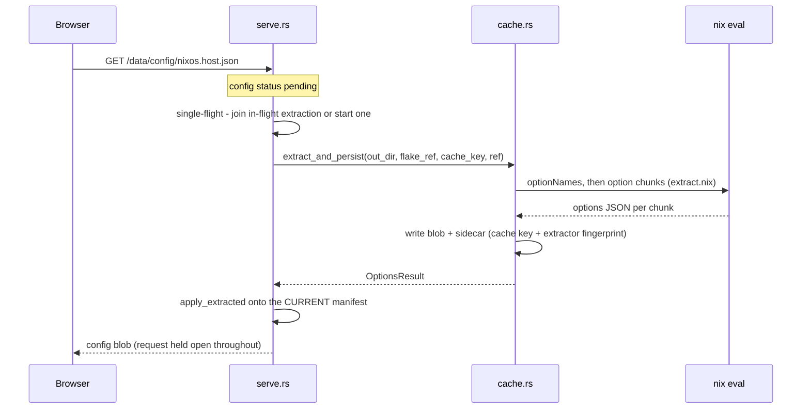

# Extraction pipeline

Extraction is two-phase. A **cheap manifest pass** (flake metadata, output tree, file list, import graph, git info) always runs up front and is always regenerated. The **expensive per-configuration options pass** — a full module-system eval — runs separately: eagerly for `extract`/`export`, or on demand in `serve` when the UI first opens a configuration. The two phases produce the two documents described in [Data schema](data-schema.md); the commands that drive them are in the [CLI reference](cli.md).

## Serve-mode on-demand flow

[`src/serve.rs`](../src/serve.rs) holds the config request open until extraction finishes — no fixed timeout, since an extraction can exceed any bound worth guessing. Concurrent requests for the same configuration are deduped through a single-flight map (`inflight: Mutex<HashMap<String, watch::Receiver<bool>>>`): the first request inserts a `watch` channel and starts the extraction, later ones clone the receiver and await the same completion signal.

```mermaid
sequenceDiagram
  participant B as Browser
  participant S as serve.rs
  participant C as cache.rs
  participant N as nix eval

  B->>S: GET /data/config/nixos.host.json
  Note over S: config status pending
  S->>S: single-flight - join in-flight extraction or start one
  S->>C: extract_and_persist(out_dir, flake_ref, cache_key, ref)
  C->>N: optionNames, then option chunks (extract.nix)
  N-->>C: options JSON per chunk
  C->>C: write blob + sidecar (cache key + extractor fingerprint)
  C-->>S: OptionsResult
  S->>S: apply_extracted onto the CURRENT manifest
  S-->>B: config blob (request held open throughout)
```

The cache check happens at manifest time, not per request: after every manifest build (startup and `POST /api/refresh`), `reconcile` flips configs to `ok` when their sidecar records the current cache key — an extractor-code fingerprint plus the flake's identity, the resolved-input lock hash, and the nix version (see cache.rs below) — those are served straight from disk. The key is captured at extraction *start*, because `/api/refresh` can swap the manifest mid-extraction and stamping the new key onto data evaluated from the old flake state would poison the cache.

## The extraction crate boundary

The fingerprint decides when a user's cached blobs are thrown away, and extraction is the expensive operation here — a full module-system eval, minutes against a real NixOS configuration. So the question of *which* code it covers is a real cost, not bookkeeping: when it hashed the whole `src/` tree, editing `serve.rs` or `page.rs` re-extracted everything for everyone, and a UI-only patch release did that to every user.

The repo is a two-member cargo workspace so the answer is structural rather than a list someone has to maintain:

| Crate | Modules | Can it shape a blob? |
| --- | --- | --- |
| `flake-explorer-extract` (`crates/extract/`) | `cache`, `git`, `highlight`, `manifest`, `options`, `package`, `pathref`, `run_nix`, `scan`, `schema`, plus `extract.nix` and the vendored queries | Yes — this is what `build.rs` hashes |
| `flake-explorer` (repo root) | `main`, `drive`, `serve`, `export`, `page`, `reverse_deps` | No |

A curated list of hashed files would have had the same intent and a worse failure mode: a forgotten entry serves stale data with no error message, where the whole-tree hash it replaced only ever cost a spurious re-extraction. Crate membership has no entry to forget — a module in the root crate cannot contribute to a blob because it cannot be reached from inside the extraction crate. Two placements are worth stating because they are not obvious from the module names:

- **`highlight` is extraction code.** `package.rs` runs `tokenize_bash` over every build phase and stores the runs in `DrvPhase.tokens`, so the tokenizer *and* the vendored `.scm` queries are bytes in a persisted package blob. Nix-source highlighting for serve and export is computed fresh and is not what puts it here.
- **`reverse_deps` is not.** Its index is only ever assigned to `Manifest.packageReverseDeps` by `export.rs`; the always-regenerated manifest leaves that field `null` and no blob carries it. It is derived from already-extracted data on every export, so it cannot go stale.

What the boundary does **not** cover is extraction *parameters*. Exactly one crosses it — the timeout, from `--timeout` through `drive.rs`/`serve.rs` into `extract_options`. A timeout is an eval failure like any other, so too short a one walks the degradation ladder below and writes a genuinely thinner blob whose sidecar records nothing about the timeout that produced it. That is a pre-existing property of a runtime flag rather than something the split introduced — the same binary at the same fingerprint already accepts a blob extracted under `--timeout 5` as fresh for a later `--timeout 600` — and it is bounded by degradation only ever subtracting, never inventing a wrong value, and by every rung and abandonment pushing a warning into the sidecar that `reconcile` re-emits as `[cached] …` for as long as the blob lives. The header comment in [`crates/extract/build.rs`](../crates/extract/build.rs) carries the full argument and the fix (record the degradation-relevant parameters in the sidecar) if it is ever wanted.

## Modules

### drive.rs — shared extraction driver

[`src/drive.rs`](../src/drive.rs) runs manifest + selected configurations into the data dir, reusing the fingerprint-keyed cache, and writes `manifest.json` so the data dir stays reconcilable for later runs. Both `extract` and `export` call it; it lives outside the CLI entry so tests can call it in-process.

### manifest.rs — the cheap pass

[`crates/extract/src/manifest.rs`](../crates/extract/src/manifest.rs) assembles the `Manifest`: `nix flake metadata` (lock graph, narHash), `nix flake show --json` (normalized across the classic and Determinate "inventory" formats), the `extract.nix` manifest eval (store paths, configuration names, `.nix` file list, grafts, output names), the static import graph, and per-file git info when the flakeref is a local checkout. The lock-graph walk (`input_infos`) dedups shared nodes into one entry per node; the follows/shared edges that dedup would drop are recorded separately as `Manifest.inputFollows` so input pages can still draw the "sops-nix/nixpkgs → nixpkgs" arrows. Config names are sanitized (`safe_name`) so a quoted attr name containing `/` cannot escape the data dir.

### extract.nix — the Nix-side core

[`crates/extract/src/extract.nix`](../crates/extract/src/extract.nix) is a single builtins-only expression (no nixpkgs `lib`, so it works on flakes without a nixpkgs input) invoked as `nix eval --impure --json --expr 'import <path>/extract.nix (builtins.fromJSON '…args…')'` — `--impure` is required for `builtins.getFlake` on path/dirty refs. It has a cheap `manifest` mode and an expensive `options` mode (plus `optionNames` for listing children). Value serialization is defensive: `scrub`/`deepSafe` degrade a poisoned value to a marker instead of killing the whole eval.

### options.rs — the chunk walk

[`crates/extract/src/options.rs`](../crates/extract/src/options.rs) walks the options tree in chunks (one per top-level namespace initially) because an uncatchable eval error — missing attr or type error, which `builtins.tryEval` cannot catch — poisons the entire eval it occurs in. The algorithm is **split first, degrade last**: a failing chunk is halved by children (or descended into) at the *same* detail level to isolate the poisoned option, so healthy siblings keep full values. Only an unsplittable leaf, or one at the depth cap (`MAX_DEPTH = 4`), walks down the degradation ladder — full → values skipped → values+descriptions skipped — before being abandoned with a warning. Chunks run on a small worker pool (2–8, derived from CPU count) and the queue is drained until no worker can push further splits.

### run_nix.rs — subprocess protocol

[`crates/extract/src/run_nix.rs`](../crates/extract/src/run_nix.rs) wraps the host's own `nix` binary (never vendored, so store paths and registry match the user's system; minimum version `MIN_NIX = 2.19`, checked by `check_nix`). All calls are JSON-in/JSON-out with a timeout that kills the process and a `NixError` carrying the underlying stderr and exit code. Args reach `extract.nix` via double `serde_json::to_string` — a JSON string literal is a valid Nix string literal, so no hand-rolled Nix escaping. Every call passes `--option lazy-trees false` to keep store paths joinable across evals. `read_input_file` re-fetches an input file through `builtins.getFlake` when a cached store path has been GC'd or was a lazy-trees synthetic path.

### cache.rs — sidecar cache

[`crates/extract/src/cache.rs`](../crates/extract/src/cache.rs) keys the cache on four components, recorded in a sidecar next to each blob (`config/<kind>.<name>.meta.json`): an **extractor fingerprint** ([`crates/extract/build.rs`](../crates/extract/build.rs) — a content hash of every `.rs` file in the `flake-explorer-extract` crate, plus its `build.rs`, `extract.nix`, and the vendored highlight queries, so any extractor change invalidates cached blobs automatically, no manual version bump; the crate boundary is what scopes it — see [The extraction crate boundary](#the-extraction-crate-boundary)), a **flake identity** (`narHash`, or the content-addressed self store path when a dirty checkout has none), a **lockHash** over the resolved input set (catches input drift the flake's own identity can't see, e.g. an uncommitted flake.lock re-resolving an unpinned input), and the **nix version** (`nix --version` verbatim).

The nix version is there because the host `nix` is the largest input to a blob that the other three components cannot see. Every eval runs `--impure`; `nix derivation show` and `nix flake show` have each changed output shape across releases, which is why [`package.rs`](../crates/extract/src/package.rs) and [`manifest.rs`](../crates/extract/src/manifest.rs) both branch on which shape they got; and `path_info` reflects local store state. Without it a nix upgrade changed what extraction produced while the key sat unmoved, and the stale blob was reused with no signal. It is the whole version string rather than a parsed `major.minor`, so a patch bump re-extracts — deliberate, because coarsening means choosing which of the two numbers in `nix (Determinate Nix 3.21.5) 2.34.8` to keep, and dropping the wrapper version discards exactly the signal the lazy-trees concern in [`run_nix.rs`](../crates/extract/src/run_nix.rs) turns on. `extract_and_persist` writes blob + sidecar (with a path-traversal guard on `dataFile`); `reconcile` flips matching configs to `ok` on a fresh manifest. It deliberately does not mutate the `ConfigRef` itself — the caller applies the outcome to whichever manifest is current when extraction settles.

### git.rs — per-file commit info

[`crates/extract/src/git.rs`](../crates/extract/src/git.rs) gets each file's last commit from a **single streamed `git log --format=… --name-only -- '*.nix'` walk**: newest-first, the first time a path appears is its last commit — one O(history) subprocess instead of O(files) `git log -1` calls. `repo_prefix` bridges repo-root-relative git paths and flake-root-relative file paths when the flake lives in a subdirectory.

### scan.rs — source-text scans

[`crates/extract/src/scan.rs`](../crates/extract/src/scan.rs) holds all three scans over the flake's own `.nix` files, each a regex pass rather than a parse:

- **The file→file import graph** (patterns in [`crates/extract/src/pathref.rs`](../crates/extract/src/pathref.rs)). Dendritic flakes have near-zero manual imports, false positives are harmless in a visualization, and `nix-instantiate --parse` re-prints Nix rather than emitting JSON, so a "real" approach would still be text-munging.
- **Input references** — `inputs.<name>` / `inputs'.<name>` (`Manifest.inputRefs`). Destructured input args (`outputs = { nixpkgs, ... }:`) are invisible to any syntactic approach, so a parser wouldn't buy correctness where it matters. Follows-aliases (`inputs.stable.follows = "nixpkgs"`) resolve to the canonical input name; unknown names are dropped.
- **Overlay definitions** — `overlays.<name>`, for the overlay pages.

The module header names tree-sitter-nix as the upgrade path.

### highlight.rs — server-side syntax highlighting

[`crates/extract/src/highlight.rs`](../crates/extract/src/highlight.rs) tokenizes Nix source — and bash phase scripts — with the native `tree-sitter-nix` and `tree-sitter-bash` grammar crates. The highlight queries are vendored as `.scm` files in [`crates/extract/src/vendor/`](../crates/extract/src/vendor) and embedded with `include_str!`; if a vendored query fails to compile against the crate's grammar version, that grammar's own bundled query is the fallback, so a grammar bump degrades instead of breaking. It resolves the query's captures into flat, non-overlapping runs (narrower node wins; on the same node the earlier-declared query pattern wins); the client only maps capture names to colors.
